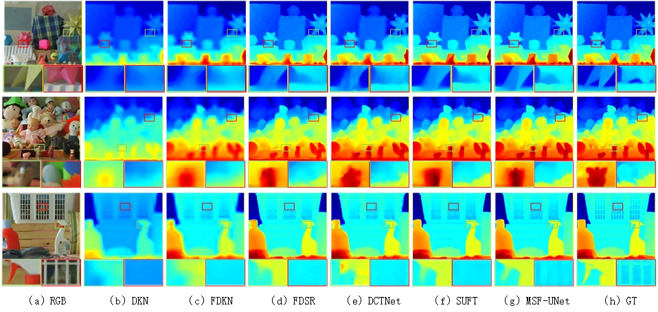
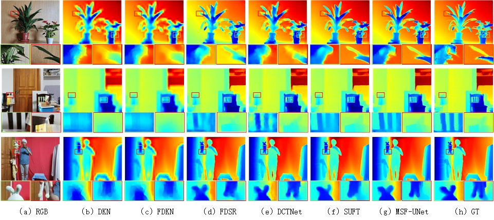

# MSF-UNet
Pytorch code for our paper: "MSF-UNet: Multi-Scale Fusion UNet for Guided Depth Map Super-Resolution"

## More visualization comparison

(1) ×16 super-resolution on the Middlebury dataset:



(2) ×16 super-resolution on the RGBDD dataset:




## More quantitative comparison (mean RMSE)

### NYUv2 Dataset:
| Methods | x4   |  x8  | x16  |
|---------|----- |------|------|
| FDSR    | 1.61 | 3.18 | 5.86 |
| DCTNet  | 1.59 | 3.16 | 5.84 |
| SUFT    | 1.12 | 2.51 | 4.86 |
| Ours    | 1.14 | 2.45 | 4.60 |

### Middlebury Dataset:
| Methods | x4   |  x8  | x16  |
|---------|----- |------|------|
| FDSR    | 1.13 | 2.08 | 4.39 |
| DCTNet  | 1.10 | 2.05 | 4.19 |
| SUFT    | 1.07 | 1.75 | 3.18 |
| Ours    | 1.18 | 1.80 | 3.11 |

### Lu Dataset:
| Methods | x4   |  x8  | x16  |
|---------|----- |------|------|
| FDSR    | 1.29 | 2.19 | 5.00 |
| DCTNet  | 0.88 | 1.85 | 4.39 |
| SUFT    | 1.10 | 1.74 | 3.92 |
| Ours    | 1.10 | 1.80 | 3.66 |

### RGBDD Dataset:
| Methods | x4   |  x8  | x16  |
|---------|----- |------|------|
| FDSR    | 1.16 | 1.82 | 3.06 |
| DCTNet  | 1.08 | 1.74 | 3.05 |
| SUFT    | 1.10 | 1.69 | 2.71 |
| Ours    | 1.18 | 1.72 | 2.69 |


## Citation
If you find our work useful in your research, please consider citing our paper:
```bibtex
@INPROCEEDINGS{11028645,
  author={Xu, Hao and Guo, Chenggang},
  booktitle={2024 International Conference on Virtual Reality and Visualization (ICVRV)}, 
  title={MSF-UNet: Multi-Scale Fusion UNet for Guided Depth Map Super-Resolution}, 
  year={2024},
  pages={88-93}
  }
```